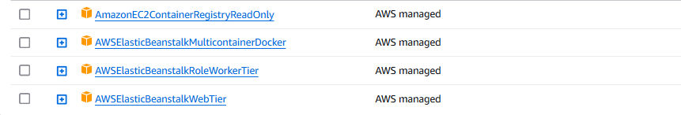
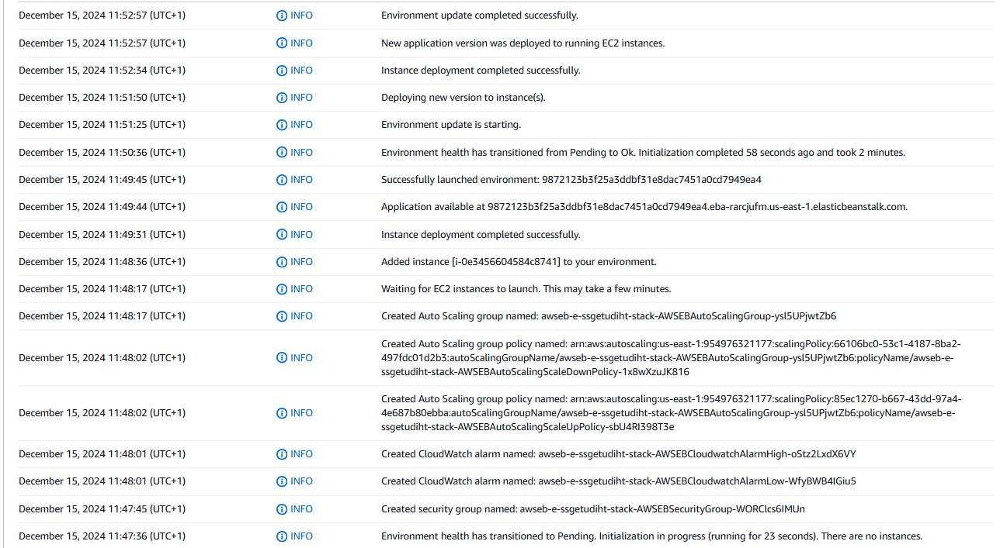
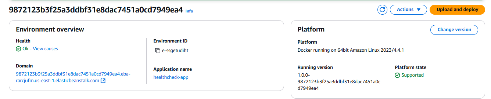
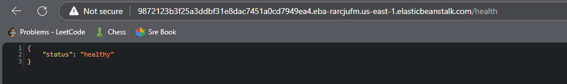
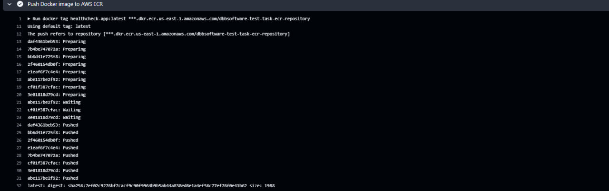
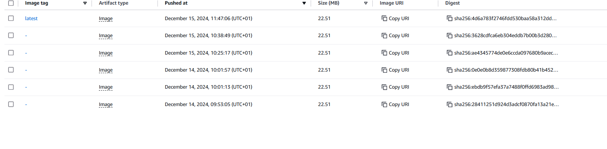

## DBB Software Test Task

In this repository you can find three branches, each one for the part of the test task.
1. **feature/python-health-app**: This branch contains the code for the Python Health App, with a Dockerfile to build the image
2. **feature/aws-cdk-setup**: Branch for the AWS CDK setup, with the required infrastructure to deploy the Python Health App
3. **feature/deploy-ci-cd**: Branch with the CI/CD pipeline, which build Docker image, pushes it to the ECR, and deploys application to the AWS Elastic Beanstalk, creating new environment

## Pre-requisites

Before running the code, You need to create an application and a role for the Elastic Beanstalk environment, with following permissions:


I've tried to create this Role using CDK, but even with specifying same policies - I could not create environments with that role. 
Application name: healthcheck-app

## Results

### Successful Deployment of the Python Health App to the AWS Elastic Beanstalk




### Successful Image Build and Push to ECR


List of images in the ECR:


## How to run the code

1. Clone the repository
In order to check CDK setup, navigate to `infra/aws`, and run (if CDK is not installed, install it first):
```sh
cdk deploy
```

2. To run the CI/CD pipeline, push the code to Github repository, and create any commit; the pipeline will be triggered automatically.
3. To run the Python Health App locally, just run 
```python
python -m venv venv
source venv/bin/activate (or venv\Scripts\activate on Windows)
pip install -r requirements.txt
python main.py
```